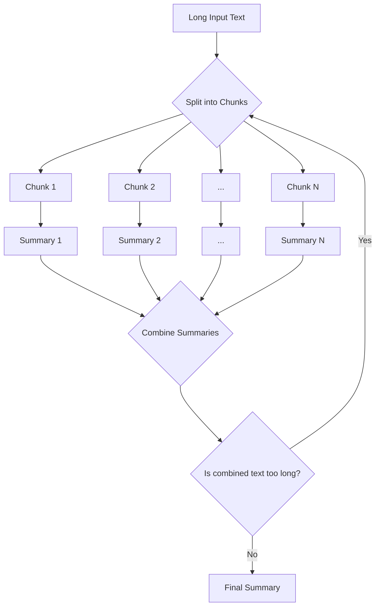

# Distilbart-Summarizer: Intelligent Summarization for Long-Form Text

[](https://choosealicense.com/licenses/mit/)
[](https://www.python.org/downloads/)

<!-- Add other badges once you have them, e.g., PyPI, Build Status -->
<!-- [](https://badge.fury.io/py/Distilbart-Summarizer) -->
<!-- [](https://travis-ci.org/your-username/Distilbart-Summarizer) -->

**Distilbart-Summarizer** is a powerful Python library designed to tackle a common challenge in Natural Language Processing: summarizing texts that are longer than the model's maximum input length. Using a flexible and efficient recursive summarization strategy, it can condense articles, research papers, legal documents, and any other long-form content into concise, coherent summaries.

> **Problem:** Transformer-based models like BART or T5 have a strict token limit (e.g., 1024 tokens), making it impossible to summarize long documents in a single pass.
>
> **Solution:** **Distilbart-Summarizer** breaks the text into manageable chunks, summarizes each one, and then recursively combines the summaries until a final, comprehensive summary is produced.

---

## Table of Contents

- [Features](#-features)
- [Example Results](#-example-results)
- [How It Works](#-how-it-works)
- [Installation](#-installation)
- [Advanced Usage](#-advanced-usage)
- [Command-Line Interface (CLI)](#-command-line-interface-cli)
- [License](#-license)
- [Acknowledgements](#-acknowledgements)

---

## Features

- **Handle Arbitrarily Long Texts:** No more "input too long" errors. Summarize documents of any length.
- **Recursive Summarization:** Implements a hierarchical strategy for high-quality final summaries.
- **Powered by Hugging Face:** Leverages state-of-the-art `transformers` models. Defaults to `facebook/bart-large-cnn`.
- **Highly Customizable:** Easily swap models, adjust chunk size, and control the summarization process.
- **Simple API:** Clean and intuitive interface for easy integration into your projects.
- **CLI Support:** Use it directly from your terminal for quick summarizations.

---

## Example Results

---


---

## How It Works

The core of **Distilbart-Summarizer** is its chunk-and-summarize pipeline. The process can be visualized as follows:



1.  **Chunking:** The input text is split into smaller, overlapping chunks that respect the underlying model's token limit.
2.  **Individual Summarization:** Each chunk is summarized independently using the specified transformer model.
3.  **Combination & Recursion:** The summaries of the chunks are concatenated.
4.  **Final Pass:** If the combined text is now short enough, it is summarized one last time to produce the final, coherent output. If it's still too long, the process repeats on the combined text (recursion).

---

## Installation

This project uses `Docker` for dependency isolation and reproducible environments.

1.  **Clone the repository:**

    ```bash
    git clone <repo-url>
    cd Distilbart-Summarizer
    ```

2.  **Build the Image**

    ```bash
    docker compose build
    ```

3.  **Run the container**

    ```bash
    docker compose up -d
    ```

4.  **Access the container**

    ```bash
    docker compose exec app bash
    ```

5.  **Run the main script**

    ```bash
    python3 main.py data/article.txt
    ```

---

## Advanced Usage

You can customize the summarization process by passing parameters during initialization or to the `summarize` method. The code is the same, just remember to run it within the `pipenv` environment.

### Using a Different Model

```python
from summarizer import Summarizer

# Initialize with a different model from the Hugging Face Hub
model = Summarizer(model_name="google/pegasus-xsum")

# ... rest of your code
```

### Adjusting Chunk and Summary Lengths

```python
from summarizer import Summarizer

model = Summarizer()
long_text = "..." # Your very long text here

# Generate a shorter, more condensed summary
short_summary = model.summarize(
    long_text,
    chunk_max_length=512,      # Max tokens for each chunk
    summary_min_length=25,     # Min length for each intermediate summary
    summary_max_length=150,    # Max length for each intermediate summary
    final_summary_min_length=50,
    final_summary_max_length=250
)

print(short_summary)
```

---

## Command-Line Interface (CLI)

For quick use, a CLI script is provided. Run it using `pipenv run` or from an activated `pipenv shell`.

```bash
pipenv run python summarize_cli.py \
    --input-file "path/to/your/article.txt" \
    --output-file "path/to/your/summary.txt" \
    --model-name "facebook/bart-large-cnn" \
    --max-length 250
```

**Arguments:**

- `--input-file`: Path to the input text file.
- `--output-file`: (Optional) Path to save the summary. If omitted, prints to console.
- `--model-name`: (Optional) Hugging Face model to use.
- `--max-length`: (Optional) Desired maximum length for the final summary.

---

## License

Distributed under the MIT License. See `LICENSE` for more information.

---

## Acknowledgements

- [Hugging Face](https://huggingface.co/) for their incredible `transformers` library.
- The research teams behind BART, T5, and other foundational summarization models.
- Thank you For checking out this project.
